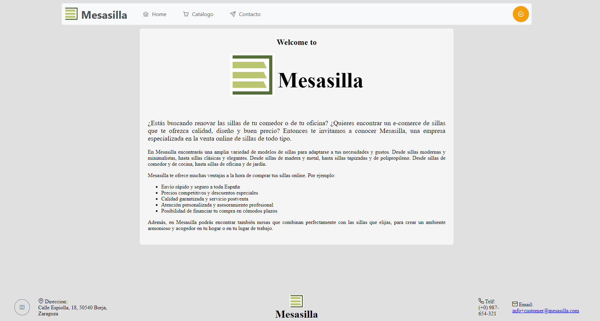

# Mesilla Web app

## Una aplicacion web con Angualar y PrimeNG

Este proyecto se trata de un ejemplo de aplicacion web de una empresa de sillas ***Mesasilla***.

Este proytecto ha sido generado con [Angular CLI](https://github.com/angular/angular-cli) version 15.1.4.

## Servidor de desarrollo

Ejecuta `ng serve` para iniciar un servidor de desarrollo. Dirijete a `http://localhost:4200/`. La aplicacion web se recargara automaticamente si cambias el codigo fuente.

## Code scaffolding

Ejecuta `ng generate component component-name` para generar un componente nuevo. También puede usar `ng generate directive|pipe|service|class|guard|interface|enum|module`.

## Compilar

Ejecuta `ng build` para compilar el proyecto. La salida de la compilación se almacenarán en el directorio `dist/`

## Running unit tests

Ejecuta `ng test` para realizar los test via [Karma](https://karma-runner.github.io).

## Running end-to-end tests

Ejecuta `ng e2e` para ejecutar las pruebas de extremo a extremo a través de una plataforma de su elección. Para usar este comando, primero debe agregar un paquete que implemente capacidades de prueba de un extremo a otro.

## Further help

Para consegir más ayuda con AngularCLI usa `gn help` o visita la pagina [Angular CLI Overview and Command Reference](https://angular.io/cli) page.
